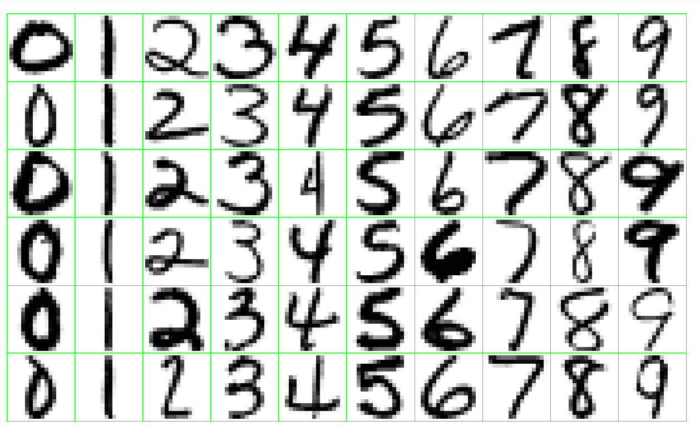
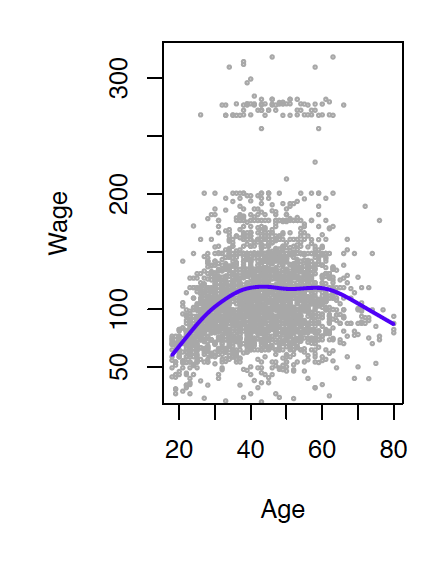
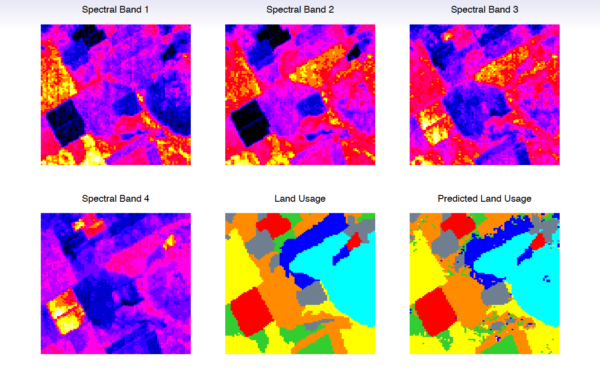

```{r child = "setup.Rmd"}
```

layout: true

<div class="my-footer">
  <span>
  Dr. Lucy D'Agostino McGowan
</span>
</div> 

---

```{r packages, echo=FALSE, message=FALSE, warning=FALSE}
library(tidyverse)
```

## `r emo::ji("wave")`

##  Lucy D'Agostino McGowan

<i class="fa fa-envelope"></i> &nbsp; [mcgowald@wfu.edu](mailto:mcgowald@wfu.edu) <br>
<i class="fa fa-calendar"></i> &nbsp; Tues/Thurs 9:30a-10:45a, 12:30p-1:45p
---

class: middle, center

Everything you will need will be posted at:

# [bit.ly/sta-363-f20](http://bit.ly/sta-363-f20)

---

# Statistical Learning Problems

.pull-left[
* Identify risk factors for breast cancer
]

.pull-right[

]

.my-footer[.small[Dr. Lucy D'Agostino McGowan _adapted from slides by Hastie & Tibshirani_
]]

---

# Statistical Learning Problems

.pull-left[
<font color="grey">
* Identify risk factors for breast cancer
</font>
* Customize an email spam detection system
]

.pull-right[
* **Data**: 4601 labeled emails sent to _George_ who works at _HP Labs_ 
* **Input features**: frequencies of words and punctuation
]

| george | you | hp | free | ! | edu | remove
--|-----|-----|----|-----|-----|----|------
**spam** | 0.00 | 2.26 | 0.02 | 0.52 | 0.51 | 0.01 | 0.28
**email** | 2.27 | 1.27 | 0.90 | 0.07 | 0.11 | 0.29 | 0.01

.my-footer[.small[Dr. Lucy D'Agostino McGowan _adapted from slides by Hastie & Tibshirani_
]]

---


# Statistical Learning Problems

.pull-left[
<font color="grey">
* Identify risk factors for breast cancer
* Customize an email spam detection system
</font>
* Identify numbers in handwritten zip code
]

.pull-right[

]

.my-footer[.small[Dr. Lucy D'Agostino McGowan _adapted from slides by Hastie & Tibshirani_
]]

---

# Statistical Learning Problems

.pull-left[
<font color="grey">
* Identify risk factors for breast cancer
* Customize an email spam detection system
* Identify numbers in handwritten zip code
</font>
* Establish the relationship between variables in population survey data
]

.pull-right[
Income survey data for males from the central Atlantic region of US, 2009

</img>

]

.my-footer[.small[Dr. Lucy D'Agostino McGowan _adapted from slides by Hastie & Tibshirani_
]]

---

# Statistical Learning Problems

.pull-left[
<font color="grey">
* Identify risk factors for breast cancer
* Customize an email spam detection system
* Identify numbers in handwritten zip code
* Establish the relationship between variables in population survey data
</font>
* Classify pixels of an image
]


.pull-right[
</img>
.small[
Usage $\in$ {red soil, cotton, vegetation stubble, mixture, gray soil, damp
gray soil}
]
]

.my-footer[.small[Dr. Lucy D'Agostino McGowan _adapted from slides by Hastie & Tibshirani_
]]

---

## `r emo::ji("v")` types of statistical learning

.large[
* Supervised Learning
* Unsupervised Learning
]
---

## Supervised Learning

.my-footer[.small[Dr. Lucy D'Agostino McGowan _adapted from slides by Hastie & Tibshirani_
]]

* **outcome variable**: $Y$, (dependent variable,
response, target)
--

* **predictors**: vector of $p$ predictors, $X$, (inputs,
regressors, covariates, features, independent variables)
--

* In the **regression problem**, $Y$ is quantitative (e.g price,
blood pressure)
--

* In the **classification** problem, $Y$ takes values in a finite,
unordered set (survived/died, digit 0-9, cancer class of
tissue sample)
--

* We have **training data** $(x_1, y_1), \dots, (x_N, y_N)$. These are
observations (examples, instances) of these measurements

---

## Supervised Learning

.question[
What do you think are some objectives here?
]

--

### Objectives

* Accurately predict unseen test cases
* Understand which inputs affect the outcome, and how
* Assess the quality of our predictions and inferences

.my-footer[.small[Dr. Lucy D'Agostino McGowan _adapted from slides by Hastie & Tibshirani_
]]
---

## Unsupervised Learning

.my-footer[.small[Dr. Lucy D'Agostino McGowan _adapted from slides by Hastie & Tibshirani_
]]

* No outcome variable, just a set of predictors (features)
measured on a set of samples
--

* objective is more fuzzy -- find groups of samples that
behave similarly, find features that behave similarly, find
linear combinations of features with the most variation
--

* difficult to know how well your are doing
--

* different from supervised learning, but can be useful as a
pre-processing step for supervised learning


---
class: center, middle

# Let's go!

---

## Log in to RStudio Pro

- **Note:** if you are off campus, you will need to use a [VPN to connect](https://is.wfu.edu/services/vpn/)
- Go to [rstudio.hpc.ar53.wfu.edu:8787](rstudio.hpc.ar53.wfu.edu:8787)
- Your username is your WFU username (typically the first part of your email)
- The password is: **R2D2Star!**

---

## <i class="fas fa-laptop"></i> Create a classification model

- Once you log on to RStudio Pro, click on this course's workspace "STA 363 - S20" then click "Projects"
- You should see a project called `zipcode`, click it.
- In the Files pane in the bottom right corner, spot the file called `zipcode.Rmd`. Open it, and then click on the "Knit" button. *You will likely see an pop-up error, click "Try Again"*
- Go back to the file and change your name on top (in the `yaml` -- we'll talk about what this means later) and knit again.
- Then, scroll to the `recipe` chunk, below **First we create a recipe**. Instead of creating a model to classify whether the number is **0** or not, create a model to predict whether the number is **1**. Knit again & voila!

<font color="#E34132">
Once done, place a green sticky on your laptop. If you have questions, place a pink sticky.
</font>

---

## Let's take a tour - class website

.center[

]

- Concepts introduced:
  - How to find slides
  - How to find assignments
  - How to find RStudio Cloud
  - How to get help
  - How to find policies


