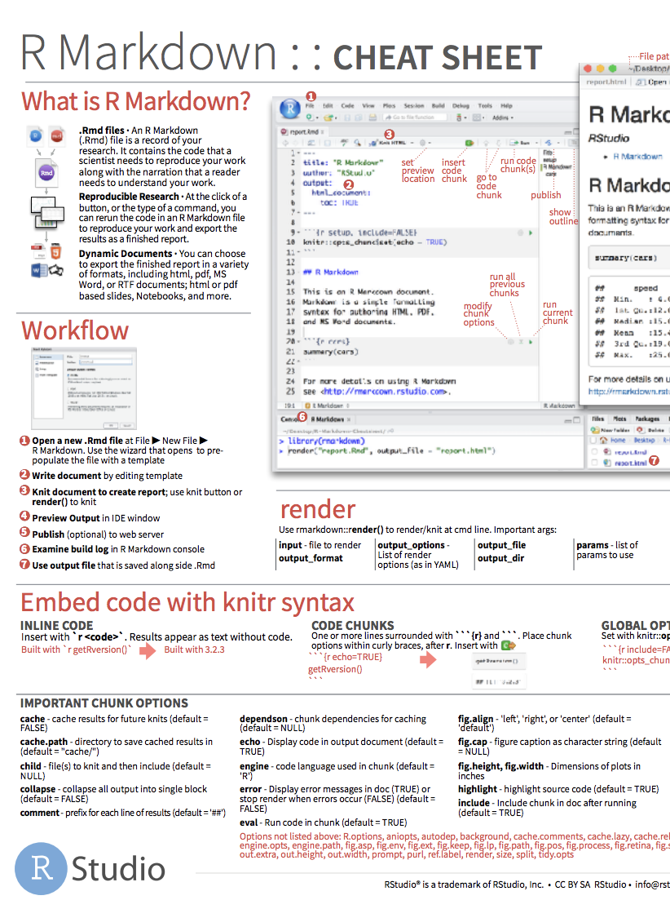
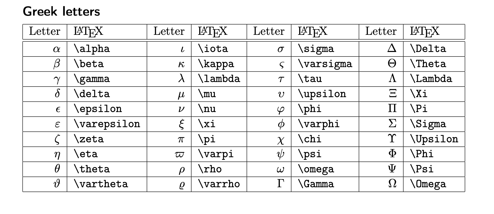
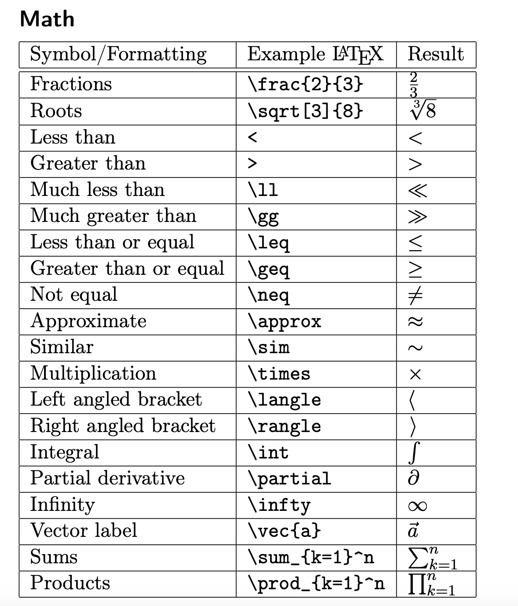

```{r child = "setup.Rmd"}
```

layout: true
  
<div class="my-footer">
<span>
 </img> Slides adapted from <a href="https://datasciencebox.org" target="_blank">datasciencebox.org</a> by Dr. Lucy D'Agostino McGowan
</span>
</div> 

---

## Agenda

- Demo: Penguin Study
- R and RStudio
- R Markdown

---


class: center, middle

# A Penguin Study

---

## Recap: What did we just do?

- Create a project in **RStudio**
- Upload a .Rmd file in **RStudio**
- Run the analysis using **R Markdown**
- Edit the analysis 
- Re-run the analysis using **R Markdown**

---

## Toolkit


- Scriptability $\rightarrow$ R
- Literate programming (code, narrative, output in one place) $\rightarrow$ R Markdown

---

class: center, middle

# R and RStudio

---

## What is R/RStudio?

- R is a statistical programming language
- RStudio is a convenient interface for R (an integreated development environment, IDE)
- At its simplest:<sup>➥</sup>
    - R is like a car’s engine
    - RStudio is like a car’s dashboard

```{r fig.align="center", echo=FALSE}
knitr::include_graphics("img/02/engine-dashboard.png")
```

.footnote[
➥ Source: [Modern Dive](https://moderndive.com/)
]

---

## Let's take a tour - R / RStudio

.center[

]

Concepts introduced:

- Console
- Using R as a calculator
- Environment
- Loading and viewing a data frame
- Accessing a variable in a data frame
- R functions

---

## R essentials

A short list (for now):

- Functions are (most often) verbs, followed by what they will be applied to in parantheses:

```{r eval=FALSE}
do_this(to_this)
do_that(to_this, to_that, with_those)
```

--

- Columns (variables) in data frames are accessed with `$`:

```{r eval=FALSE}
dataframe$var_name
```

--

- Packages are installed with the `install.packages` function and loaded with the `library` function, once per session:

```{r eval=FALSE}
install.packages("package_name")
library(package_name)
```

---

## tidyverse

.pull-left[

]

.pull-right[
.center[
[tidyverse.org](https://www.tidyverse.org/)
]

- The tidyverse is an opinionated collection of R packages designed for data analysis and data science. 
- All packages share an underlying philosophy and a common grammar. 
]

---


## tidymodels

.pull-left[

]

.pull-right[
.center[
[tidyverse.org](https://www.tidyverse.org/)
]

- tidymodels is an opinionated collection of R packages designed for modeling and statistical analysis.
- All packages share an underlying philosophy and a common grammar. 
]

---

class: center, middle

# R Markdown

---


## R Markdown

- Fully reproducible reports -- each time you knit the analysis is run from the beginning
- Simple markdown syntax for text
- Code goes in chunks, defined by three backticks, narrative goes outside of chunks
- Math mode in `$` 

---

## Let's take a tour - R Markdown


.center[

]

Concepts introduced:

- Knitting documents
- R Markdown and (some) R syntax
- Math mode

---

## R Markdown help

.pull-left[
.center[
[R Markdown cheat sheet](https://github.com/rstudio/cheatsheets/raw/master/rmarkdown-2.0.pdf)
]

]
.pull-right[
.center[
Markdown Quick Reference  
`Help -> Markdown Quick Reference`
]

]

---

## Math mode help

You can integrate $\LaTeX$ in R by wrapping equations in `$` `$`

.pull-left[
[Here is a Latex Cheat Sheet](https://sites.lsa.umich.edu/wp-content/uploads/sites/244/2015/04/LaTeX-Syntax-Cheat-Sheet.pdf)

]
.pull-right[

]
---

## Workspaces

Remember this, and expect it to bite you a few times as you're learning to work 
with R Markdown: The workspace of your R Markdown document is separate from the Console!

- If I run the following in the console

.small[
```{r eval = FALSE}
x <- 2
x * 3
```
]

--
.question[
All looks good, eh?
]

--

- Then, if I add the following chunk in my R Markdown document

.small[
```{r eval = FALSE}
x * 3
```
]
--

.question[
What happens? Why the error?
]

---

## How will we use R Markdown?

- Every assignment / report / project / etc. is an R Markdown document
- You'll always have a template R Markdown document to start with
- The amount of scaffolding in the template will decrease over the semester

---

## Turning in Assignments

- Each Lab will have a "starter file" on Canvas. Download this before beginning the lab and upload to RStudio Pro to help you get started.
- After completing your Lab, download the .html file from RStudio Pro 
- Upload this file to Canvas
