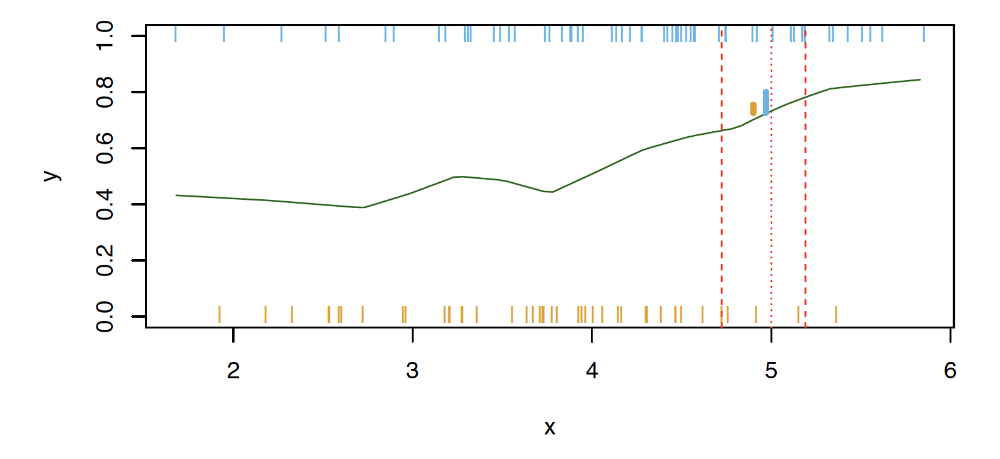

```{r child = "setup.Rmd"}
```

layout: true

<div class="my-footer">
<span>
Dr. Lucy D'Agostino McGowan <i>adapted from slides by Hastie & Tibshirani</i>
</span>
</div> 

```{r, echo = FALSE, message = FALSE, warning = FALSE}
knitr::opts_chunk$set(echo = FALSE, message = FALSE, warning = FALSE)
library(tidyverse)
```

---

class: center, middle

# Classification

---

## Notation

* $Y$ is the response variable. It is **qualitative**
* $\mathcal{C}(X)$ is the classifier that assigns a class $\mathcal{C}$ to some future unlabeled observation, $X$
--

* Examples:
  * Email can be classified as $\mathcal{C}=(\texttt{spam, not spam})$
  * Written number is one of $\mathcal{C}=\{0, 1, 2, \dots, 9\}$

---

## Classification Problem

.question[
What is the goal?
]

--

* Build a classifier $\mathcal{C}(X)$ that assigns a class label from $\mathcal{C}$ to a future unlabeled observation $X$  
* Assess the uncertainty in each classification  
* Understand the roles of the different predictors among $X = (X_1, X_2, \dots, X_p)$

---

<center>
</img>
</center>

Suppose there are $K$ elements in $\mathcal{C}$, numbered $1, 2, \dots, K$

$$p_k(x) = P(Y = k|X=x), k = 1, 2, \dots, K$$
These are **conditional class probabilities** at $x$

--

.question[
How do you think we could calculate this?
]
--

* In the plot, you could examine the mini-barplot at $x = 5$
---

<center>
</img>
</center>

Suppose there are $K$ elements in $\mathcal{C}$, numbered $1, 2, \dots, K$

$$p_k(x) = P(Y = k|X=x), k = 1, 2, \dots, K$$
These are **conditional class probabilities** at $x$

* The **Bayes optimal classifier** at $x$ is

$$\mathcal{C}(x) = j \textrm{ if } p_j(x) = \textrm{max}\{p_1(x), p_2(x), \dots, p_K(x)\}$$

???

* Notice that probability is a **conditional** probability 
* It is the probability that Y equals k given the observed preditor vector, $x$ 
* Let's say we were using a Bayes Classifier for a two class problem, Y is 1 or 2. We would predict that the class is one if $P(Y=1|X=x_0)>0.5$ and 2 otherwise

---

<center>
</img>
</center>

.question[
What if this was our data and there were no points at exactly $x = 5$? Then how could we calculate this?
]

--
* Nearest neighbor like before!

--
* This does break down as the dimensions grow, but the impact of $\mathcal{\hat{C}}(x)$ is less than on $\hat{p}_k(x), k = 1,2,\dots,K$

---

## Accuracy

* Misclassification error rate

$$Err_{\texttt{test}} = \textrm{Ave}_{i\in\texttt{test}}I[y_i\neq \mathcal{\hat{C}}(x_i)]$$

--
* The **Bayes Classifier** using the true $p_k(x)$ has the smallest error
--

* Some of the methods we will learn build structured models for $\mathcal{C}(x)$ (support vector machines, for example)
--

* Some build structured models for $p_k(x)$ (logistic regression, for example)

???

* the test error rate $\textrm{Ave}_{i\in\texttt{test}}I[y_i\neq \mathcal{\hat{C}}(x_i)]$ is minimized on average by very simple classifier that assigns each observation to the most likely class, given its predictor values (that's the Bayes classifier)

---

## K-Nearest-Neighbors example

</img>

???

* Here is a simulated dataset of 100 observations in two groups, blue and orange
* The purple dashed line represents the Bayes decision boundary
* The orange background grid indicates the region where the test observations will be classified as orange, and the blue for the blue
* We'd love to be able to use the Bayes classifier to but for real data, we don't know the conditional distribution of Y given X so computing the Bayes classifier is impossible
* Alot of methods try to estimate the conditional distribution of Y given X and then classify a given observation to the class with the highest **estimated** probability
* One method to do this is K-nearest neighbors

---

## KNN (K = 10)

</img>

???

* Again, the way KNN works is if K = 10, it is finding the 10 closest observations and calculating the probability of being orange or blue and will classify that point as such
* So here is an example of K nearest neighbors where K is 10

---

## KNN


???

* Because this dataset has 100 data points, K can range from 1 to 100 where at 1, the error rate in the TRAINING data will be 0 but the test error rate may be really high. So we are trying to find the happy medium. The test error is going to have that same u-shape relationship, you want to find the bottom of that U

---

## Trade-offs


